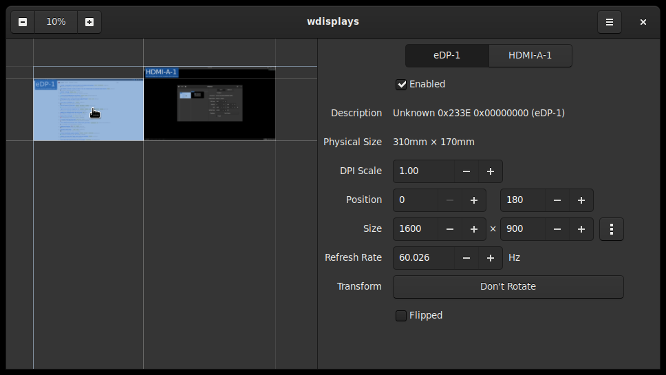

# wdisplays

[](https://spdx.org/licenses/MIT.html)

wdisplays is a graphical application for configuring displays in Wayland
compositors. It borrows some code from [kanshi]. It should work in any
compositor that implements the wlr-output-management-unstable-v1 protocol,
including [sway].



# Building

Build requirements are:

- GTK+3
- epoxy
- wayland-client

```sh
meson build
ninja -C build
sudo ninja -C build install
```

# FAQ (Fervently Anticpiated Quandaries)

### What is this?

It's intended to be the Wayland equivalent of an xrandr GUI, like [ARandR].

### Help, I get errors and/or crashes!

Make sure your wlroots and sway are up-to-date. Particularly, you need a git
revision of wlroots from [this commit](https://github.com/swaywm/wlroots/commit/724b5e1b8d742a8429f4431ae1a55d7d26cb92ae)
(or later) or your compositor may crash when adding/removing displays.
Alternatively, you can try to disable the "Show Screen Contents" option.

### I'm using Sway, why aren't my display settings saved when I log out?

Sway, like i3, doesn't save any settings unless you put them in the config
file. See man `sway-output`. If you want to have multiple configurations
depending on the monitors connected, you'll need to use an external program
like [kanshi].

[kanshi]: https://github.com/emersion/kanshi
[sway]: https://github.com/swaywm/sway
[ARandR]: https://christian.amsuess.com/tools/arandr/
